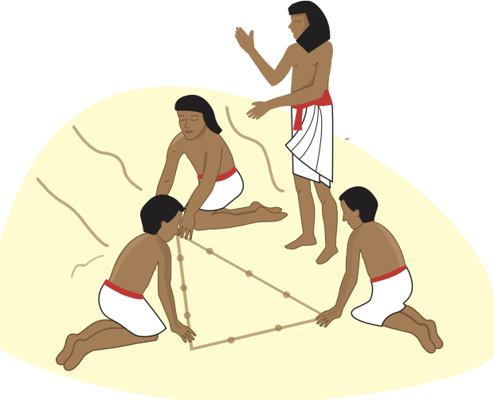
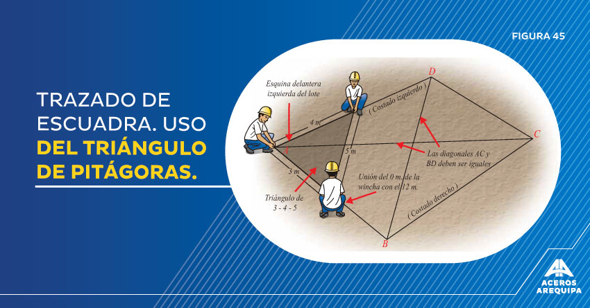
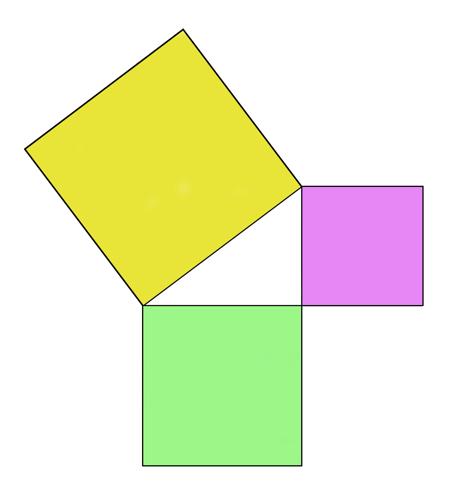
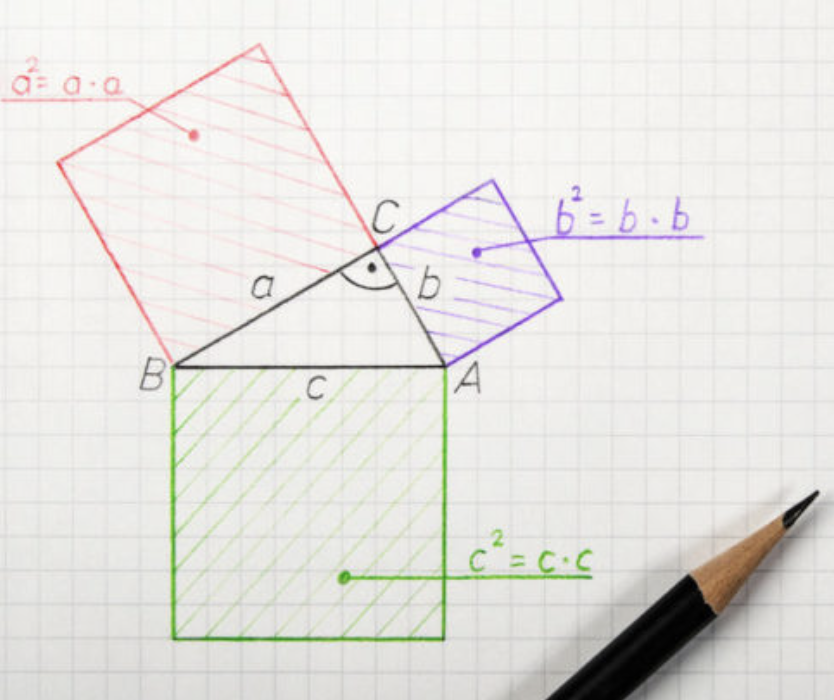
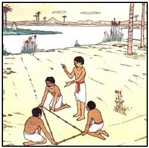

class: inverse, center, middle

```{r xaringan-opts, echo=FALSE}
library(xaringanExtra)
xaringanExtra::use_editable(expires = 1)
xaringanExtra::use_scribble()
#xaringanExtra::use_share_again()
#xaringanExtra::style_share_again(
#  share_buttons = c("twitter")
#)
```

<span style="font-size:35px;color:white"> Un poco de historia

<span style="font-size:30px;color:white"> ¿Quiénes desarrollaron el Teorema de Pitágoras?
---
# Un momento... ¿no fue Pitágoras?

.pull-left[

</br>

```{r out.width = '110%', echo=FALSE, fig.align='center'}
knitr::include_graphics("Plimpton_322.jpg")
```

<small> Tomada de [Babylonian tablet listing pythagorean triples](https://es.wikipedia.org/wiki/Plimpton_322#/media/Archivo:Plimpton_322.jpg).

]

.pull-right[

* La tablilla **Plimpton 322** fue escrita entre 1822 y 1762 a. C.

* Se descubrió en Irak (donde se desarrolló la civilación babilonia).

* Distintos análisis sugieren que Plimpton 322 contiene **ternas pitagóricas**.

* La tableta fue descubierta por [Edgar James Banks](https://en.wikipedia.org/wiki/Edgar_James_Banks). En él se inspiraron para Indiana Jones.

```{r out.width = '50%', echo=FALSE, fig.align='center'}
knitr::include_graphics("Edgar_James_Banks.jpg")
```

]
---
# ¿Ternas pitagóricas?

.pull-left[
### ¿Qué son?

Es un arreglo ordenado de 3 números enteros positivos $\color{red}{a}$, $\color{blue}{b}$ y $\color{darkgreen}{c}$ tales que

$$
  \color{red}{a}^2 + \color{blue}{b}^2 = \color{darkgreen}{c}^2 
$$

Notar que se trata de un problema "algebraico", por eso no hay dibujos (todavía).


### Ejemplos

* La terna $(\color{red}{3},\ \color{blue}{4},\ \color{darkgreen}{5})$ es pitagórica porque

$$
\color{red}{3}^2 + \color{blue}{4}^2  = 9 + 16 = 25 = \color{darkgreen}{5}^2
$$
* La terna $(\color{red}{5},\ \color{blue}{12},\ \color{darkgreen}{13})$ también es pitagórica.
]


.pull-right[
### Propiedad importante

Si multiplicamos cada número de una terna pitagórica por un mismo entero positivo, obtenemos otra terna pitagórica.


### Ejemplo

* Empezamos con $(\color{red}{3},\ \color{blue}{4},\ \color{darkgreen}{5})$.
* Multiplicamos cada número de la terna por $\textbf{4}$.
* Obtenemos $(\color{darkred}{12},\ \color{darkblue}{16},\ \color{darkgreen}{20})$, y notamos que

$$
\color{darkred}{12}^2 + \color{darkblue}{16}^2 = 144 + 256 = 400 = \color{darkgreen}{20}^2
$$
]

---
# ¿Cómo lo usaban?

.pull-left[

</br>
</br>

Se sugiere que los egipcios unían 12 segmentos de soga de la misma longitud.

Entonces estiraban $\color{darkgreen}{5}$ de dichos segmentos consecutivos.

Luego tiraban del lazo para formar un triángulo $(\color{red}{3},\ \color{blue}{4},\ \color{darkgreen}{5})$ que es **triángulo rectángulo**.

]

.pull-right[

</br>

```{r out.width = '100%', echo=FALSE, fig.align='center'}

```

<small> Tomada de [Teorema de Pitágoras](https://www.jica.go.jp/Resource/project/elsalvador/004/materials/ku57pq00003uf5za-att/text_JS3_06.pdf).
]

---
# ¿Todavía se usa?

</br>


```{r out.width = '110%', echo=FALSE, fig.align='center'}

```

<small> Tomada de [Consejo de construcción al trazar a escuadra](https://www.construyendoseguro.com/consejo-de-construccion-al-trazar-a-escuadra/).

---
# Ahora, ¿áreas?

.pull-left[

Los griegos no sabían álgebra, entonces, ¿que decía el **Teorema de Pitágoras**?

</br>

<span style="font-size:32px"> El <span style="color:darkgreen">área del cuadrado</span> construido sobre el lado opuesto al ángulo recto es igual a la <span style="color:darkred">suma de las áreas de los cuadrados</span> construidos sobre los lados que comprenden el ángulo recto.
]

.pull-right[

</br>

```{r out.width = '500%', echo=FALSE, fig.align='center'}

```

]

---
# Mejor agregamos álgebra

.pull-left[

<span style="font-size:25px"> Como se observa, el resultado geométrico es complicado. Por ello, si consideramos que $\color{red}{a}$ y $\color{blue}{b}$ son las longitudes de los **catetos** de un triángulo rectángulo y $\color{darkgreen}{c}$ es la longitud de la **hipotenusa**, entonces

<span style="font-size:25px"> $$
  \color{red}{a}^2 + \color{blue}{b}^2 = \color{darkgreen}{c}^2 
$$

</br>
¿Qué representa cada uno de esos cuadrados?
]


.pull-right[

</br>

```{r out.width = '100%', echo=FALSE, fig.align='center'}

```

Tomada de [Enciclopedia Humanidades](https://humanidades.com/teorema-pitagoras/).
]
---
class: inverse, center

</br>

</br>

</br>

<span style="font-size:35px;color:white"> ¿Por qué es importante el Teorema de Pitágoras?

---
# Alineación de terrenos y escalas

.pull-left[

* <span style="font-size:20px"> Cada año, el río Nilo se desbordaba, entonces tenían que realinear los terrenos: usaban el triángulo $(\color{red}{3},\ \color{blue}{4},\ \color{darkgreen}{5})$.

</br>

```{r out.width = '120%', echo=FALSE, fig.align='center'}

```

]


.pull-right[

* <span style="font-size:20px"> EL Teorema de Pitágoras es equivalente a la semejanza de triángulos, por lo cual se pueden hacer modelos a escala: esto se usa en el diseño de cualquier edificio.

</br>

```{r out.width = '120%', echo=FALSE, fig.align='center'}

```
]
---
# Trigonometría

.pull-left[

</br>
* <span style="font-size:20px"> Para algunos historiadores, Plimpton 322 es una de las primeras tablas trigonométricas.


* <span style="font-size:20px"> Las funciones trigonométricas se pueden definir a partir de un triángulo rectángulo: ¡¡ las identidades que conocemos se obtienen a partir del Teorema de Pitágoras !!


* <span style="font-size:20px"> También las leyes de senos y cosenos se deducen del Teorema de Pitágoras.
]


.pull-right[

</br>

</br>
```{r out.width = '140%', echo=FALSE, fig.align='center'}
knitr::include_graphics("razones-trigonometricas.jpg")
```
]

---
# Versiones curiosas del Teorema de Pitágoras

Poner el ejercicio del Purcell: empezar con 

---
# Paralelas

Dejar esto al final para usarlo de inmediato: explicar el quinto postulado

---
class: inverse, center

</br>

</br>

</br>

<span style="font-size:35px;color:white"> ¿Y la forma del Universo?

---
# Empecemos más cerca: este salón

Sugerir que el mundo es plano

---
# Vamos más lejos: nuestro Planeta

Poner un dibujo de un triángulo con 3 ángulos rectos

---
# Ahora, en pequeño: unas papitas

Hablar de geometría hiperbólica: mencionar que no hay triángulos de 180°
Hablar de los problemas si el mundo fuera así

---
# ¿Qué sabemos?

Mencionar a Gauss y sus mediciones
Hablar de mediciones más recientes
---

